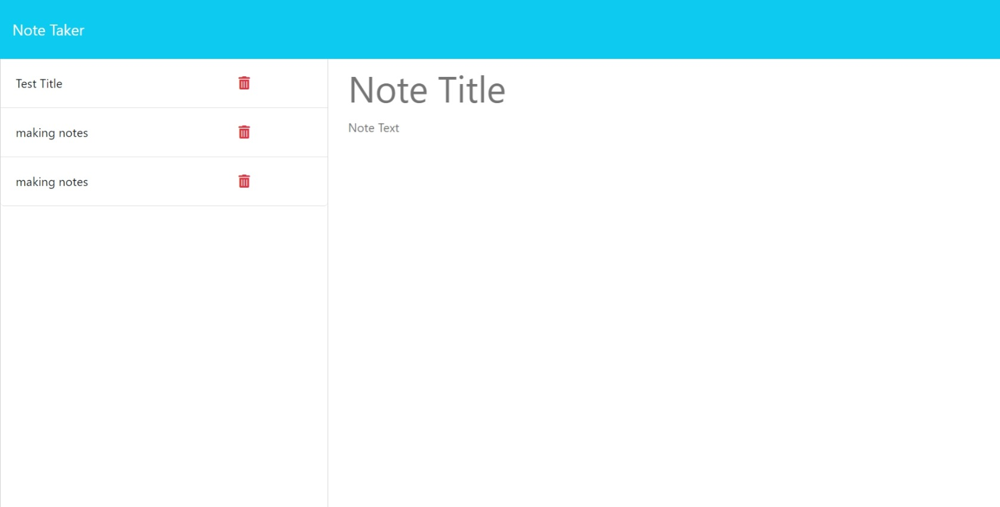

### Note Taker ###

# The challenge 
The  Challenge was to create an application called Note Taker that can be used to write and save notes. The application would use an Express.js back end and will save and retrieve note data from a JSON file.
# Description
A back end site used to take notes and save, and delete them 

# What was your motivation? 

My motivation for this project was to further expand my coding knowledge.

# Why did you build this project? 

For practice to enter the job force in the future with improved coding skills.

# What did you learn? 

I learned how to write routes and i learned that uuid is used to generate universally unique identifiers (UUIDs)

# Installation
What are the steps required to install your project? 
Provide a step-by-step description of how to get the development environment running
- click on live link, 
-hit note taker
- write note
- hit save

# Usage

# screenshot

# live link :
https://module-once-11.onrender.com

